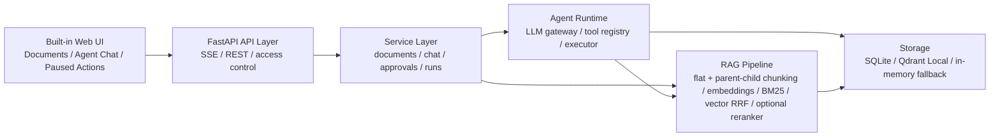

# Multi Tool Agent

This repository contains a local-first knowledge-base Agent system built with FastAPI + SSE, bounded tool calling, hybrid and parent-child RAG, optional reranking, human approval, persisted traces, and reproducible evaluation/demo checks.

## Current status

Last verified on `2026-06-19` with:

```powershell
.\.venv312\Scripts\python.exe -m pytest -q
```

| Area | Status | Evidence |
| --- | --- | --- |
| API and Agent runtime | Implemented | FastAPI + SSE, bounded `Plan -> Tool -> Answer`, max 3 tool rounds |
| RAG retrieval | Implemented | Flat lexical/vector/hybrid retrieval plus parent-child strategies with child vector recall, BM25 recall, parent aggregation, and optional CrossEncoder reranking |
| Evaluation | Reproducible local baseline | `129 passed`; benchmark script compares lexical/vector/hybrid/parent_child/parent_child_rerank and reports Recall@5 plus parent/evidence counts |
| Demo path | One-command local verification | document upload, search, reindex, and SSE chat pass through `scripts/verify-local-embeddings.ps1` |
| Delivery | Packaged for handoff | `Dockerfile`, `docker-compose.yml`, and GitHub Actions workflow are present |
| Security posture | Local-first | `.env` is ignored, remote API access requires explicit token/configuration |

Docker is not installed in the current local workspace, so the image build is configured in CI but has not been locally built on this machine.

## Architecture



## Included in v1

- FastAPI server
- SSE chat endpoint
- Agent runtime with explicit state, events, and bounded multi-step tool use
- Tool registry and executor
- Persistent document ingestion with flat and hierarchical parent-child indexing modes
- Hybrid lexical/vector retrieval plus parent-child and optional reranker strategies
- LLM gateway abstraction with mock fallback
- Embedding provider and vector store abstractions with local hash fallback
- Approval, persistence, MCP discovery, tracing, and evaluation seams

## Project evidence docs

- [Project status](./docs/project-status-2026-06-19.md): current verified state, parent-child RAG implementation status, safe claims, and remaining gaps
- [Previous project status](./docs/project-status-2026-06-15.md): earlier baseline before parent-child retrieval
- [Baseline audit](./docs/baseline-audit-2026-06-15.md): latest local test/demo/benchmark evidence
- [Demo script](./docs/demo-script.md): 2-minute interview walkthrough
- [Resume bullets](./docs/resume-bullets.md): resume-ready bullets and interview anchors
- [Internship project prep](./docs/internship-project-prep.md): longer architecture and Q&A notes

## Quick start

1. Create a virtual environment.
2. Install dependencies with `pip install -e .` or `pip install -e .[dev]`.
3. If you want the local open-source embedding model, install the extra with `pip install -e .[local-embeddings]`.
4. Copy `.env.example` to `.env` if you want to override defaults.
5. Run the server:

```bash
uvicorn app.api.server:app --reload
```

6. Open the built-in app at `http://127.0.0.1:8000/app/`.

On Windows, you can also double-click [Launch Multi Tool Agent App.bat](./Launch%20Multi%20Tool%20Agent%20App.bat) or run:

```bash
powershell -ExecutionPolicy Bypass -File .\scripts\start-agent-app.ps1
```

The launcher waits for the API to become ready and then opens the browser automatically.

## Docker quick start

Build and run the local demo container:

```bash
docker compose up --build
```

Then open `http://127.0.0.1:8000/app/`.

The default Compose profile uses deterministic local settings: `LLM_PROVIDER=mock`, `EMBEDDING_PROVIDER=hash`, SQLite metadata storage, and an in-memory vector store. It also sets `API_ALLOW_REMOTE_WITHOUT_TOKEN=true` so the browser on the host can call the containerized local API during development. For a shared or hosted deployment, set `API_AUTH_TOKEN` instead.

You can also build the image directly:

```bash
docker build -t multi-tool-agent .
docker run --rm -p 8000:8000 -e API_ALLOW_REMOTE_WITHOUT_TOKEN=true multi-tool-agent
```

## CI and baseline checks

The GitHub Actions workflow is configured for pushes to `main` and pull requests. It installs the Python package, runs `pytest -q`, builds the Docker image, starts the container, and checks `/api/health`.

For the fuller local evidence chain, including the local embedding demo and retrieval benchmark, run:

```powershell
powershell -ExecutionPolicy Bypass -File .\scripts\check-baseline.ps1 -DemoPort 8013
```

## LLM provider modes

- `LLM_PROVIDER=mock`: deterministic local planner and responder
- `LLM_PROVIDER=openai`: OpenAI-compatible chat completions with automatic fallback to `mock`

If you use the OpenAI-compatible mode, set:

- `LLM_API_KEY` or `OPENAI_API_KEY`
- `LLM_BASE_URL`
- `DEFAULT_MODEL`

Runs are persisted to the local SQLite file configured by `RUN_STORAGE_PATH`.
Recent session messages are loaded back into the agent up to `SESSION_HISTORY_LIMIT`.
MCP tool discovery reads from `MCP_CONFIG_PATH` when that file exists.
API requests include an `x-request-id` response header, and server logs include `request_id` plus `run_id` when a chat run is active.

## API access control

The API is local-first by default. Requests to `/api/health` are public, but other `/api/...` routes are allowed only from localhost unless remote access is explicitly configured.

For remote access, set:

- `API_AUTH_TOKEN`: require remote callers to send `Authorization: Bearer ...` or `X-API-Key`
- `API_ALLOW_REMOTE_WITHOUT_TOKEN=true`: development-only escape hatch for remote calls without a token

If `API_AUTH_TOKEN` is empty and `API_ALLOW_REMOTE_WITHOUT_TOKEN=false`, non-local API calls return `403`.

## Knowledge store modes

- `KNOWLEDGE_STORE_PROVIDER=sqlite`: default local knowledge metadata store on disk
- `KNOWLEDGE_STORE_PROVIDER=postgres`: Postgres-compatible knowledge metadata store for hosted deployments
- `KNOWLEDGE_STORE_PROVIDER=memory`: in-process store for ephemeral testing

If you use the local SQLite mode, set:

- `KNOWLEDGE_STORE_PATH`

If you use the Postgres-compatible mode, set:

- `KNOWLEDGE_STORE_DATABASE_URL`

The Postgres mode uses the optional `psycopg` dependency:

```bash
pip install -e .[postgres]
```

The current recommended local setup stores knowledge metadata on your current drive and leaves a clean seam for a later cloud migration. The API and service layer already depend on a `KnowledgeStore` interface, so you can point the same document endpoints at a Postgres-compatible cloud database later without changing the service layer.

## Embedding provider modes

- `EMBEDDING_PROVIDER=hash`: deterministic local embeddings for offline development
- `EMBEDDING_PROVIDER=openai`: OpenAI-compatible embeddings endpoint with automatic fallback to `hash`
- `EMBEDDING_PROVIDER=sentence_transformers`: local open-source embeddings using `sentence-transformers`

If you use the OpenAI-compatible embedding mode, set:

- `EMBEDDING_API_KEY` or reuse `LLM_API_KEY`
- `EMBEDDING_BASE_URL`
- `EMBEDDING_MODEL`

If you use the local `sentence_transformers` mode, set:

- `EMBEDDING_MODEL`
- `EMBEDDING_DIMENSIONS`
- `EMBEDDING_DEVICE`
- `EMBEDDING_CACHE_PATH` points at a local Hugging Face cache when you do not want to use the global cache
- `EMBEDDING_LOCAL_FILES_ONLY=true` forces cached/offline model loading
- `EMBEDDING_FALLBACK_ENABLED` controls whether provider failures may fall back to hash embeddings

The current recommended local model is `intfloat/multilingual-e5-small`, which is multilingual and uses `query:` / `passage:` prefixes for retrieval.
On Windows, this mode also depends on a working local PyTorch runtime. If PyTorch or its native DLL dependencies are missing, keep `EMBEDDING_PROVIDER=hash` until the runtime is fixed.
When fallback is enabled, stored chunks are labeled with the actual embedding signature that produced the vector, so future searches can ignore incompatible vector scores.

## OCR document parsing

PDF parsing uses `pdfplumber` for native text and table extraction. OCR for scanned PDFs and image uploads is optional because PaddleOCR and PaddlePaddle are heavier dependencies.

Install OCR support with:

```bash
pip install -e .[ocr]
```

OCR-related settings:

- `DOCUMENT_OCR_ENABLED=true`
- `DOCUMENT_OCR_MAX_PAGES=50`
- `DOCUMENT_OCR_MIN_NATIVE_CHARS=50`

If OCR dependencies are not installed, image uploads and scanned PDFs return a clear parsing error instead of silently indexing empty text.

For this workspace, the validated path is a separate Python 3.12 environment:

```bash
.\.venv312\Scripts\python.exe -m pytest -q
powershell -ExecutionPolicy Bypass -File .\scripts\start-local-embeddings.ps1
```

If you want a matching environment template, start from [.env.local-embeddings.example](./.env.local-embeddings.example) and merge the values into your local `.env`.

That script starts the app with:

- `EMBEDDING_PROVIDER=sentence_transformers`
- `EMBEDDING_MODEL=intfloat/multilingual-e5-small`
- `KNOWLEDGE_STORE_PROVIDER=sqlite`
- `KNOWLEDGE_STORE_PATH=./data/knowledge_base_312_live.db`
- `VECTOR_STORE_PROVIDER=qdrant_local`
- a separate local Qdrant path and SQLite run database under `data/`

To verify the whole stack end to end, run:

```bash
powershell -ExecutionPolicy Bypass -File .\scripts\verify-local-embeddings.ps1
```

That script starts the app on a temporary port, uploads a sample document, runs search, runs reindex, and confirms the chat path can still answer from the knowledge base.

## Vector store modes

- `VECTOR_STORE_PROVIDER=memory`: local in-memory vector index
- `VECTOR_STORE_PROVIDER=qdrant_local`: embedded Qdrant persisted on local disk, no separate service required
- `VECTOR_STORE_PROVIDER=qdrant`: Qdrant-compatible HTTP backend with automatic in-memory fallback

If you use the embedded local mode, set:

- `VECTOR_STORE_PATH`
- `VECTOR_STORE_COLLECTION`

If you use the Qdrant-compatible HTTP mode, set:

- `VECTOR_STORE_URL`
- `VECTOR_STORE_COLLECTION`
- `VECTOR_STORE_API_KEY` when required by your deployment
- `VECTOR_STORE_QUERY_FALLBACK_ENABLED=true` only if you explicitly want searches to use the in-process fallback copy when Qdrant is unavailable

The recommended local setup in this repository is:

- `LLM_PROVIDER=openai` with your DeepSeek-compatible chat API
- `EMBEDDING_PROVIDER=hash`
- `VECTOR_STORE_PROVIDER=qdrant_local`

This gives you persistent vector storage without Docker or a paid vector database. When your local PyTorch runtime is ready, you can switch to `EMBEDDING_PROVIDER=sentence_transformers`.

## RAG indexing and retrieval modes

The default profile remains conservative:

- `RAG_INDEXING_MODE=flat`
- `DEFAULT_RETRIEVAL_STRATEGY=hybrid`
- `RERANKER_PROVIDER=none`

Flat mode stores one list of chunks and supports the existing `lexical`, `vector`, and `hybrid` strategies. Hybrid ranking uses weighted Reciprocal Rank Fusion so keyword and vector scores are not directly mixed.

Hierarchical mode enables parent-child retrieval:

- parent blocks target about `1600` characters and are returned as answer context
- child chunks target about `450` characters and are embedded for vector recall
- child chunks store `parent_id`, `parent_index`, and offsets
- BM25-style keyword recall searches child chunks
- vector recall searches child chunks
- parent aggregation returns one result per parent with evidence child ids
- `parent_child_rerank` can rerank parent candidates when the optional CrossEncoder dependency is installed

Common settings:

- `PARENT_CHUNK_SIZE=1600`
- `PARENT_CHUNK_OVERLAP=160`
- `CHILD_CHUNK_SIZE=450`
- `CHILD_CHUNK_OVERLAP=80`
- `BM25_ENABLED=true`
- `ADVANCED_PARENT_CANDIDATE_LIMIT=20`
- `RERANKER_PROVIDER=none` or `cross_encoder`
- `RERANKER_MODEL=BAAI/bge-reranker-base`

Install optional retrieval extras as needed:

```bash
pip install -e .[rag-advanced]
pip install -e .[reranker]
```

`rank-bm25` is optional because the project includes a deterministic local BM25 fallback. `sentence-transformers` is required only for local embedding models and CrossEncoder reranking. The `faiss` optional dependency group is reserved for a future vector-store backend; Qdrant Local remains the implemented persistent vector backend.

Search endpoints accept an optional strategy:

```text
GET /api/documents/search?query=...&strategy=parent_child
GET /api/documents/search?query=...&strategy=parent_child_rerank
```

The `search_knowledge_base` tool also accepts `strategy` with `lexical`, `vector`, `hybrid`, `parent_child`, or `parent_child_rerank`.

## Chat streaming endpoint

Send a `POST` request to `/api/chat/stream` with:

```json
{
  "session_id": "demo-session",
  "message": "Please search the knowledge base for deployment steps."
}
```

The runtime emits structured SSE events. In `mock` mode, tool selection uses local heuristics. In `openai` mode, planning and answer generation can call a real model and still fall back safely if the provider request fails.
The runtime can execute up to `MAX_TOOL_STEPS` tool-planning rounds before producing the final answer. Each planning round may call at most one tool; high-risk tools still pause for approval before execution.

## Retrieval benchmark

The retriever supports flat lexical/vector/hybrid search and parent-child search with child vector recall, BM25 recall, parent aggregation, and optional reranking. A small, reproducible local ablation is included under `evaluation/`: 12 knowledge snippets grounded in project capabilities and 30 manually labelled queries.

Run the benchmark with the validated local embedding environment:

```powershell
.\.venv312\Scripts\python.exe -X utf8 .\scripts\evaluate_retrieval.py
```

The script can evaluate `lexical`, `vector`, `hybrid`, `parent_child`, and `parent_child_rerank` with `intfloat/multilingual-e5-small` plus Qdrant Local, and writes the latest JSON and Markdown results to `evaluation/results/`. Reports include Hit@1, Recall@3, Recall@5, MRR@3, P50/P95 latency, average parent candidates, and average evidence children.

Latest measured local result from the existing flat-retrieval baseline:

| Strategy | Hit@1 | Recall@3 | MRR@3 | P50 latency | P95 latency |
| --- | ---: | ---: | ---: | ---: | ---: |
| lexical | 80.0% | 96.7% | 87.8% | 0.06 ms | 0.16 ms |
| vector | 90.0% | 96.7% | 93.3% | 12.07 ms | 14.22 ms |
| hybrid | 93.3% | 100.0% | 96.1% | 12.24 ms | 14.12 ms |

See [evaluation/results/retrieval_benchmark_latest.md](./evaluation/results/retrieval_benchmark_latest.md) for the generated report.

## Built-in app

The built-in web application is served from `/app/` and groups the current local workflow into three panes:

- `Documents`: upload pasted text or local TXT/Markdown/CSV/JSON/HTML/XML/PDF/DOCX/image files, inspect stored content, run search, and reindex embeddings. PDF uploads use `pdfplumber` for native text and table extraction when available; scanned PDFs and images can use the optional OCR extra.
- `Agent Chat`: send messages to the agent, follow the user-facing transcript, and keep technical SSE details folded into an advanced panel
- `Paused Actions`: handle only the high-risk runs that paused for confirmation, while runs, payloads, and tool inventory stay in an advanced foldout

## Document ingestion endpoints

- `POST /api/documents` stores a document in the configured knowledge store
- `POST /api/documents/upload` stores a base64-encoded text, PDF, DOCX, or image file after extracting text
- `POST /api/documents/reindex` starts a background reindex job and returns a `job_id`
- `GET /api/documents/reindex/{job_id}` returns the reindex job status and final summary
- `GET /api/documents` lists stored documents
- `GET /api/documents/{document_id}` returns the raw document content
- `GET /api/documents/search?query=...&strategy=...` runs direct knowledge search with `lexical`, `vector`, `hybrid`, `parent_child`, or `parent_child_rerank`
- `GET /api/runs` lists persisted agent runs
- `GET /api/runs/{run_id}` returns the run summary and event timeline
- `GET /api/sessions/{session_id}/messages` returns persisted user and assistant messages for a session
- `GET /api/tools` lists built-in and discovered tools
- `POST /api/approvals/{run_id}` approves or rejects a paused high-risk tool call

Example document upload:

```json
{
  "title": "deployment-guide",
  "content": "Deployment steps: configure environment variables, start the FastAPI service, then check the health endpoint."
}
```

Example file upload:

```json
{
  "title": "release-notes",
  "file_name": "release-notes.pdf",
  "content_type": "application/pdf",
  "content_base64": "base64-encoded-file-bytes",
  "metadata": {"team": "platform"}
}
```

File upload safety limits are configurable:

- `DOCUMENT_UPLOAD_MAX_BYTES`: maximum decoded file size, default `20971520`
- `DOCUMENT_UPLOAD_MAX_EXTRACTED_CHARS`: maximum extracted text length, default `2000000`
- `DOCUMENT_PDF_MAX_PAGES`: maximum PDF page count when page metadata is available, default `300`
- `EXTRACTION_EXPORT_PATH`: directory used for generated extraction CSV/XLSX files

Exhaustive extraction results, such as "list all C class journals and exclude conferences", include downloadable CSV and XLSX links when the extraction produces rows. Large extraction results can be paged with `limit` and `offset`; after a paged answer, the user can ask "continue" or "next page" and the agent will reuse the previous extraction query with the next offset.

Example reindex request after changing the embedding provider:

```json
{
  "clear_vector_store": true
}
```

The response is a job record. Poll `GET /api/documents/reindex/{job_id}` until `status` is `completed` or `failed`.
Reindex job status is persisted in the SQLite database configured by `RUN_STORAGE_PATH`, so a restarted API process can still return the last known job state.

## Health checks

- `GET /api/health` is a lightweight process check
- `GET /api/health/deep` checks the knowledge store, vector store, embedding provider, and LLM provider configuration

## Approval demo

The built-in `send_email` tool is marked as high risk and pauses execution for approval. In `mock` mode, a message like this triggers the approval flow:

```json
{
  "session_id": "ops-session",
  "message": "Please send email to ops@example.com subject: Restart body: Restart the service at 5 PM."
}
```

Approve it with:

```json
{
  "action": "approve"
}
```

## MCP discovery demo

Copy [mcp_servers.example.json](./config/mcp_servers.example.json) to `config/mcp_servers.json`, then start the app and inspect `GET /api/tools`.

Discovered MCP tools can run in two modes:

- `transport: "mock"` returns the configured `mock_result_template`
- `transport: "http"` or `"streamable_http"` sends JSON-RPC requests to the configured `endpoint`

For HTTP MCP servers, set `initialize: true` when the server expects an MCP `initialize` request before tool calls. If the server returns an `mcp-session-id` header, later requests include it automatically. Set `discover_tools: true` to call `tools/list` during registration and add any returned tools alongside statically configured tools. Static tool definitions still work when discovery is disabled.
The HTTP transport supports `tools/list` and `tools/call` responses with MCP-style text content. stdio process transport is still a later integration step.

## Recommended next milestone

The next milestone is to strengthen external proof and RAG quality rather than adding many new features:

- capture a Web UI screenshot or short demo recording
- verify Docker build and GitHub Actions in a Docker-enabled environment
- run and publish parent-child/reranker benchmark results on a larger query set with difficult negative examples
- add end-to-end answer quality metrics such as citation coverage and groundedness
- then consider a FAISS backend, durable reindex queue, stdio MCP transport, and richer memory policies
