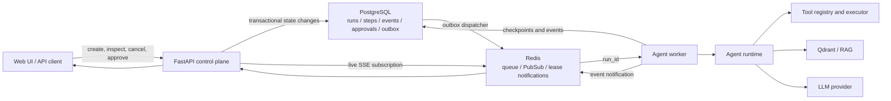
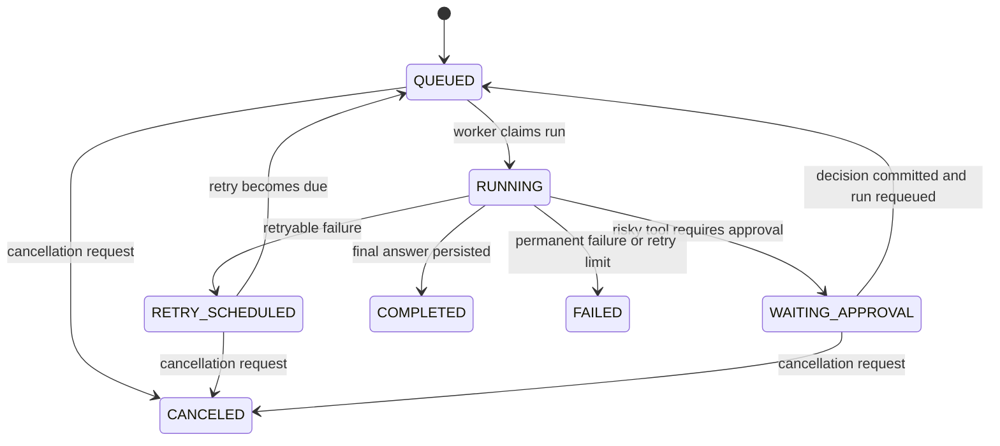

# Durable Agent Execution Platform Design

Date: 2026-07-12

## Summary

This design upgrades the existing in-process enterprise knowledge-base Agent into a durable execution platform for an Agent platform/backend engineering portfolio. FastAPI becomes the control plane, PostgreSQL becomes the source of truth for runs and events, Redis provides asynchronous dispatch and live notifications, and independent workers execute the existing bounded Plan-Tool-Answer runtime. The platform adds recoverable execution, idempotent step handling, explicit retry and cancellation policies, replayable SSE, observability, fault-injection evaluation, Docker orchestration, and a public deployment.

The work is scoped to a two-to-three-week implementation. It preserves the current RAG, tool registry, approval flow, document pipeline, and compatibility chat endpoint. It does not attempt to build multi-agent collaboration, a complete multi-tenant authorization system, or a large MCP marketplace in the same slice.

## Motivation and Portfolio Positioning

The repository already demonstrates FastAPI/SSE APIs, a bounded Agent loop, tool validation, human approval, persisted traces, document parsing and OCR hooks, hybrid and parent-child RAG, Qdrant integration, and a reproducible local benchmark. The main backend-platform gap is that Agent execution is still coupled to the API request process and SQLite persistence. A process failure can interrupt an active run, live delivery and durable history are not separated, and retries, leases, cancellation, and recovery are not first-class concepts.

The target portfolio claim is:

> Upgraded an in-process knowledge-base Agent into a durable execution platform using FastAPI, PostgreSQL, Redis, and asynchronous workers, with persisted run/step state, idempotent retries, approval recovery, replayable events, fault-injection evaluation, and Docker-based public deployment.

Only measured test, load, recovery, and evaluation results may be added to the resume after implementation.

## Goals

- Separate HTTP request handling from Agent execution.
- Persist every run, step, event, approval, and configuration snapshot in PostgreSQL.
- Dispatch work through Redis while keeping PostgreSQL as the authoritative state store.
- Recover runs after API, worker, or Redis interruptions.
- Prevent duplicate progress when a queue message or approval request is delivered more than once.
- Add explicit timeout, retry, cancellation, and side-effect safety policies.
- Support SSE history replay and reconnect through monotonic event sequence numbers.
- Add Agent-platform evaluation covering tool selection, approval policy, recovery, and duplicate execution.
- Provide Docker Compose orchestration and one publicly reachable deployment.
- Preserve the existing chat, RAG, tool, approval, and test behavior during migration.

## Non-Goals

- Multi-agent planning, delegation, or agent-to-agent protocols.
- Complete organization, tenant, and role-management features.
- A large collection of new tools or a full MCP marketplace.
- Exactly-once execution claims for arbitrary external side effects.
- Replacing the current RAG pipeline or expanding its benchmark as the primary workstream.
- A complex custom monitoring frontend; the run timeline is required, while Grafana remains optional.
- Automatic retries for tools whose external side effects cannot be made idempotent.

## Current Baseline

`AgentRuntime.stream()` currently creates an in-memory `RunState`, plans and executes tools in the API process, and yields events directly to the HTTP SSE response. `ChatService` persists those events to a SQLite repository. The existing approval flow stores pending tool details and resumes through the API service. Run status currently includes `running`, `waiting_approval`, `completed`, and `failed`.

This is a useful compatibility baseline, but it couples task lifetime to the serving process and lacks a durable queue, worker lease, persisted step checkpoint, transactional dispatch, cancellation state, retry schedule, and event replay contract.

## Target Architecture

PostgreSQL is the only source of truth. Redis contains dispatch messages and ephemeral notifications, not the canonical run history. If a Redis notification is lost, the SSE endpoint can replay events from PostgreSQL. If dispatch fails after a run is committed, the transactional outbox republishes it.

## Component Boundaries

### FastAPI Control Plane

The API validates requests, creates runs, exposes state and event endpoints, accepts cancellation and approval decisions, and performs authentication and rate limiting. It does not execute the Agent loop inline.

### Agent Runtime

The current planning and tool execution logic remains the domain engine. It is refactored to accept a persisted execution checkpoint and to return discrete step outcomes. It must not depend on FastAPI, Redis, or a live SSE connection.

### Run Orchestrator

The new orchestrator loads the run snapshot, acquires or verifies a lease, advances one or more steps, persists each completed step, emits durable events, and schedules retry or approval transitions. It owns state-machine invariants but delegates planning and tool execution to existing components.

### Worker and Queue Adapter

An asynchronous worker receives `run_id` messages and invokes the orchestrator. The first implementation uses an async Redis worker library such as ARQ behind a `RunQueue` interface. Business services depend on that interface rather than the library API.

### Repository and Event Store

Repository protocols isolate the orchestration layer from PostgreSQL implementation details. SQLite may remain available for narrow unit tests and the legacy local profile, but the durable worker profile requires PostgreSQL. The event store assigns per-run sequence numbers and supports paged replay.

### Outbox Dispatcher and Recovery Sweeper

The dispatcher publishes committed outbox records to Redis and marks successful publication. The sweeper detects expired worker leases and overdue retry schedules, then creates idempotent outbox records to requeue eligible runs.

### SSE Gateway

The SSE endpoint first reads events after the requested sequence from PostgreSQL and then subscribes to Redis notifications. A notification causes another database read. This avoids treating PubSub payloads as durable data and closes reconnect gaps.

## Run and Step State Machines

Run states:

`COMPLETED`, `FAILED`, and `CANCELED` are terminal. A conditional database update enforces legal transitions and increments the run version. Workers check cancellation between LLM and tool steps; an in-flight external request is allowed to return, but no subsequent step begins.

Step types are `PLAN`, `TOOL_CALL`, `APPROVAL`, and `ANSWER`. Step states are `PENDING`, `RUNNING`, `COMPLETED`, `FAILED`, and `SKIPPED`. Each step has a stable idempotency key derived from the run, logical step sequence, step type, and relevant versioned input.

## Data Model

### `agent_runs`

- Identity and input: `run_id`, `session_id`, `user_message`.
- State control: `status`, `version`, `attempt_count`, `max_attempts`, `next_retry_at`.
- Lease control: `lease_owner`, `lease_expires_at`.
- Cancellation: `cancel_requested_at`.
- Reproducibility: `config_snapshot_json` containing prompt, model, tool, and retrieval versions.
- Result and failure: `final_response`, `error_code`, `error_message`.
- Timestamps: created, updated, started, and completed.

### `run_steps`

- `step_id`, `run_id`, `sequence`, `step_type`, and `status`.
- `idempotency_key` with a unique constraint scoped to the run.
- Redacted `input_json` and `output_json`.
- Provider, model, tool, attempt count, latency, token usage, and classified error fields.
- Start and completion timestamps.

### `run_events`

- `event_id`, `run_id`, per-run `sequence`, `event_type`, `data_json`, and `created_at`.
- A unique constraint on `(run_id, sequence)`.
- Append-only semantics for application code.

### `run_approvals`

- Approval, run, and step identity.
- Redacted tool and argument snapshot plus risk level.
- `pending`, `approved`, `rejected`, or `expired` status.
- Actor, reason, decision time, request time, and expiry.
- A conditional update ensures that only `pending` can be decided.

### `outbox_events`

- Outbox identity, topic, deduplication key, payload, creation time, attempt count, and publication time.
- Run creation and its dispatch outbox record are committed in one transaction.
- Requeue requests use a deduplication key so recovery scans do not create an unbounded number of equivalent messages.

## Reliable Execution Semantics

### Delivery and Claiming

Queue delivery is at least once. A worker claims a run only when its status is eligible and its lease is absent or expired. The claim uses an atomic conditional update and records the worker identity and lease expiry. The worker renews the lease during execution. Duplicate messages that cannot claim the run exit successfully without advancing it.

### Checkpointing and Resume

Every completed logical step is committed before the next step begins. After a crash, the orchestrator loads completed steps and resumes at the next logical step. A completed step with the same idempotency key is reused rather than executed again.

Approval checkpoints include the planner output, pending tool and arguments, prior tool results, next sequence number, and versioned configuration. Approval does not rerun the preceding planner step. Rejection is converted into a structured tool outcome before the final answer step.

### Retry Classification

- Transient failures include timeouts, rate limits, provider 5xx responses, and temporary Redis, Qdrant, or network failures.
- Permanent failures include invalid arguments, unknown tools, invalid configuration, and policy violations.
- Indeterminate side-effect failures require attention rather than automatic retry.

Default policy:

- LLM calls: three attempts with jittered exponential backoff near 1, 3, and 9 seconds.
- Read-only tools: three attempts.
- Retrieval: two attempts, followed by a configured safe fallback with an explicit degradation event when possible.
- Side-effect tools: automatic retry only when the adapter accepts and honors an idempotency key.
- Run recovery: at most three recovery attempts before terminal failure.

### Side-Effect Safety

The design does not claim exactly-once behavior for arbitrary external systems. Each tool declares whether it is read-only, idempotent with a key, or non-idempotent. Non-idempotent high-risk tools require approval and do not retry automatically after an indeterminate result. The execution record preserves the operator-facing failure state.

## API Contract

New asynchronous endpoints:

- `POST /api/runs` creates a run and returns HTTP 202 with `run_id`.
- `GET /api/runs/{run_id}` returns state and summary.
- `GET /api/runs/{run_id}/steps` returns step details.
- `GET /api/runs/{run_id}/events` streams replayable SSE events.
- `POST /api/runs/{run_id}/cancel` requests cancellation.
- `POST /api/runs/{run_id}/approvals/{approval_id}` records an approval decision.
- `GET /api/metrics/summary` exposes demo-safe aggregates.
- `POST /api/evaluations` starts an offline evaluation.
- `GET /api/evaluations/{evaluation_id}` returns its state and report link.

The existing `/api/chat/stream` remains as a compatibility facade: it creates a run and subscribes to that run's event stream. SSE event IDs use the durable per-run sequence. `Last-Event-ID` or an explicit `after_sequence` parameter requests replay.

## Observability

Each run has a trace ID. Plan, LLM, retrieval, tool, approval, and answer steps create spans through OpenTelemetry-compatible instrumentation. Structured logs include run, step, trace, model, tool, transition, retry, latency, token, and classified error fields. Secrets and configured sensitive tool fields are redacted before persistence or logging.

Core Prometheus metrics:

- Run count and duration by terminal status.
- Queue wait time and queue depth.
- Step count and duration by type and status.
- Retry count by error type.
- Tool call count by tool and status.
- Approval wait duration.
- LLM token usage by provider and model.
- Active worker count.

The built-in Run Detail view shows the durable timeline, step duration, retry and approval decisions, redacted parameter summaries, and final answer. Grafana is an optional Docker Compose profile, not an acceptance dependency.

## Agent Evaluation

The current retrieval benchmark remains intact. A separate Agent platform evaluation measures:

- Tool-selection accuracy.
- Tool-argument schema validity.
- Task completion and correct terminal state.
- Approval-policy accuracy.
- Recovery success after injected failures.
- Duplicate side-effect count under duplicate delivery and approval.
- Citation coverage and unsupported-claim rate for knowledge answers.
- Queue, step, and end-to-end latency percentiles.

The initial suite contains 30-40 deterministic mock scenarios for CI, 15-20 real-model scenarios for a manually triggered report, and 10 fault-injection scenarios covering timeouts, rate limits, duplicate messages, worker crashes, Redis interruption, and duplicate approval submission. Reports capture prompt, model, tool, dataset, and retrieval versions. Real-model evaluation does not block ordinary CI.

## Deployment and Security

The minimal Docker Compose profile contains `api`, `worker`, `postgres`, and `redis`. Qdrant may run as a service or use the existing configured backend. Prometheus and Grafana are optional profiles. API and worker use the same image with different entry commands. Database migration runs as a single explicit deployment job rather than from every application replica.

The public environment requires HTTPS, an API token, a CORS allowlist, request rate limits, upload limits, liveness and readiness checks, secret injection, initialized demo data, and bounded worker concurrency. LLM and infrastructure credentials never reach the browser. The selected hosting provider must support the API, worker, PostgreSQL, Redis, persistent configuration, and TLS; provider selection is deferred to the implementation plan because it depends on available accounts and budget.

## Testing and Acceptance Criteria

### Compatibility

- The existing 129-test baseline continues to pass.
- Chat, RAG, tool execution, approval, persistence, and SSE behavior remain compatible.
- The legacy chat streaming endpoint works through the new asynchronous backend.

### Durability and Correctness

- Runs remain queryable after API and worker restarts.
- Eligible runs recover after an expired worker lease.
- Clearing or restarting Redis does not remove PostgreSQL run, step, or event history.
- SSE reconnect after a known sequence produces no event gap; clients can deduplicate by event ID.
- Duplicate queue messages cannot create duplicate completed logical steps.
- Duplicate approval decisions execute the pending tool at most once.
- Terminal and canceled runs cannot begin new steps.

### Fault and Concurrency Verification

- Fifty concurrent mock run submissions all reach a valid terminal or approval-waiting state.
- Killing a worker before and after a tool boundary results in one durable final outcome after recovery.
- Simulated LLM 429 and 5xx responses exercise backoff, retry limits, and error classification.
- A temporary Redis outage leaves a committed outbox record that is eventually dispatched.
- A side-effect tool without idempotency support is not retried automatically after an indeterminate failure.

### Delivery Evidence

- `docker compose up` starts the minimal platform.
- CI runs unit, integration, state-machine, and fault-injection tests.
- The repository contains a generated Agent evaluation report.
- A public HTTPS demo exposes health, run creation, event streaming, timeline, and approval behavior.
- Documentation includes the architecture diagram and a two-to-three-minute interview demo script.
- Resume metrics are updated only from captured verification artifacts.

## Implementation Sequence for Two to Three Weeks

### Phase 1: Durable Core

- Introduce repository protocols, PostgreSQL schema/migrations, expanded states, and step/event/approval/outbox models.
- Refactor the runtime into resumable step outcomes without changing existing Agent behavior.
- Add state-machine and repository tests.

### Phase 2: Async Execution and Recovery

- Add the Redis queue adapter, worker entry point, orchestrator, outbox dispatcher, leases, sweeper, retries, cancellation, and approval requeue.
- Add replayable SSE and keep `/api/chat/stream` compatible.
- Add duplicate-delivery and worker-crash tests.

### Phase 3: Evidence and Delivery

- Add metrics, structured traces, run timeline improvements, and the Agent evaluation runner.
- Expand Docker Compose, CI, fault-injection scripts, and public deployment configuration.
- Capture measured results, refresh documentation and demo script, and align resume wording with the implemented repository.

If time becomes constrained, optional Grafana, real-model evaluation volume, and UI polish are reduced first. Durable execution, recovery, approval safety, replayable events, tests, and deployment remain mandatory.

## Risks and Mitigations

- **Scope expansion:** Keep multi-agent, tenancy, broad RBAC, and MCP transport outside this slice.
- **Dual persistence complexity:** Introduce repository protocols and migrate run persistence before worker orchestration.
- **Redis message loss:** Use PostgreSQL outbox records and periodic recovery scans.
- **Duplicate external effects:** Require tool capability metadata and idempotency keys; stop automatic retries when outcome is indeterminate.
- **SSE race during replay-to-live transition:** Treat PubSub as a notification only and re-read PostgreSQL after subscription.
- **Worker crash during a long provider call:** Use leases and stable step keys; document the boundary for non-idempotent calls.
- **Public-demo cost or abuse:** Require authentication, request limits, bounded concurrency, mock defaults, and explicit real-model enablement.
- **Resume overclaiming:** Publish only results backed by committed reports and deployment evidence.

## Resume Alignment After Implementation

The current resume should be corrected to match repository evidence: the built-in frontend is plain HTML/JavaScript rather than React/TypeScript, transport is SSE rather than a demonstrated WebSocket path, and the verified baseline is 129 tests rather than 78. The final platform bullet should add PostgreSQL, Redis, asynchronous workers, recoverable state, idempotent execution, and measured recovery or concurrency results only after those features pass acceptance verification.
